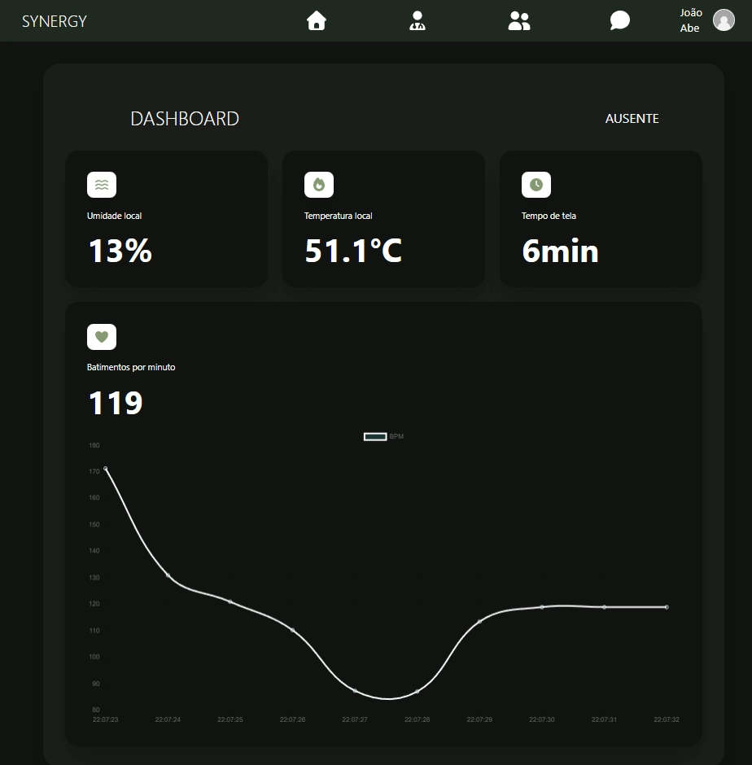
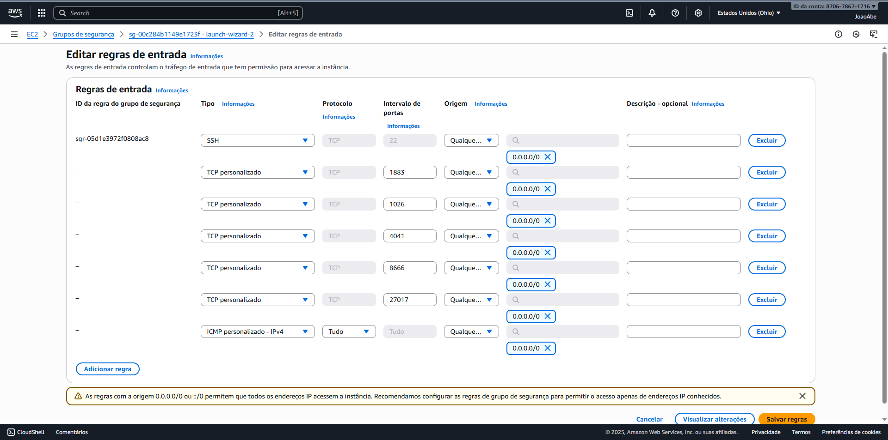
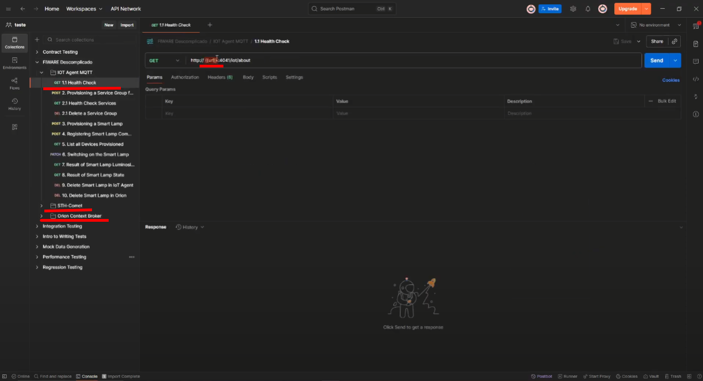
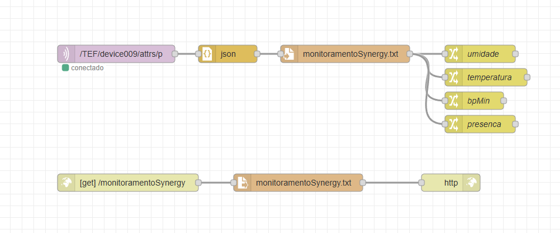
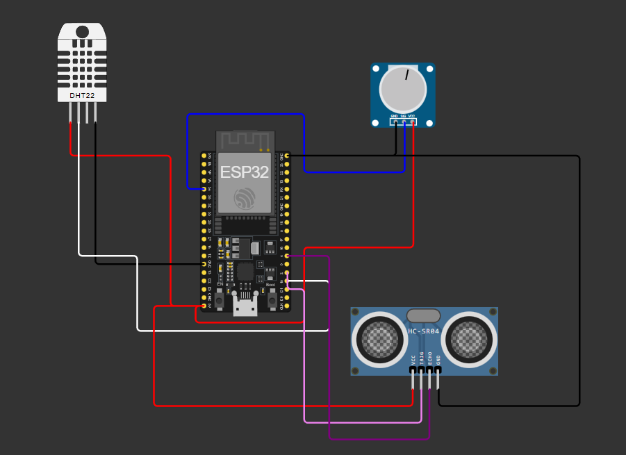

# PLATAFORMA SYNERGY

## Problema 
A chegada de novas tecnologias no ambiente de trabalho é inevitável e traz benefícios significativos, como aumento da produtividade e simplificação de tarefas. No entanto, esse avanço também gera desafios importantes: com a elevação da eficiência, algumas funções podem se tornar redundantes, colocando em risco a manutenção de empregos e impactando negativamente a saúde dos trabalhadores.
Diante desse cenário, é essencial que o futuro do trabalho considere não apenas ganhos de produtividade, mas também a implementação de medidas de saúde e segurança, garantindo um equilíbrio entre eficiência e bem-estar.

## Oportunidade identificada
O uso intensivo de novas tecnologias exige que os trabalhadores passem longos períodos frente a telas e em ambientes específicos, o que pode afetar tanto a saúde física quanto mental. O uso excessivo de dispositivos digitais está associado a problemas como:

-   Nomofobia (medo de ficar sem o celular);
-   Aumento da depressão;
-   Redução do quociente de inteligência;
-   Elevação dos níveis de estresse.


Além disso, fatores ambientais, como temperatura e umidade inadequadas, também podem reduzir a produtividade. A oportunidade identificada, portanto, é criar soluções que promovam saúde, bem-estar e produtividade, prevenindo efeitos adversos do uso prolongado de tecnologias e das condições do ambiente de trabalho.

## Proposta

A plataforma SYNERGY foi concebida para endereçar esses problemas. Trata-se de uma rede social colaborativa voltada para trabalhadores de múltiplas áreas, que oferece:
-   Sistema de postagens e comentários;
-   Possibilidade de seguir outros usuários;
-   Mensagens diretas entre profissionais;
-   Avaliação e destaque dos melhores profissionais.

O diferencial da SYNERGY é a integração com IoT (Internet das Coisas), permitindo o monitoramento em tempo real de:

-	Temperatura e umidade do ambiente de trabalho;
-	Batimentos cardíacos e níveis de estresse;
-	Tempo de exposição a telas.

Dessa forma, a plataforma não só conecta profissionais, mas também promove saúde ocupacional, ajudando o usuário a manter a sinergia entre produtividade e bem-estar.

## Funcionalidades da plataforma

As funcionalidades da plataforma incluem:
- Login e Cadastro de novos usuários;

- Seção HOME:
    - Visualizar POSTAGENS criadas por outros usuários;
    - Criar POSTAGENS novas;
    - Acessar o perfil de forma rápida;
    - Filtrar as POSTAGENS por autor ou título;
    - Visualizar usuários mais bem avaliados da plataforma.

- Seção MEU PERFIL:
    - Visualizar TODAS as informações cadastradas;
    - Acessar DASHBOARD;
    - Sair da Conta;

- Seção DASHBOARD:
    - Monitorar Umidade local;
    - Monitorar Temperatura local;
    - Monitorar Batimentos Cardíacos do usuário;
    - Monitorar Tempo de tela;

- Seção Funcionários:
    - Visualizar Todos os trabalhadores cadastrados;
    - Opção de Filtra-los a partir do NOME, ÁREA DE ATUAÇÃO E LOCAL;
    - Visualizar informações em específico de um usuário;
    - Enviar mensagem direta;

- Seção Exibindo:
    - Visualizar todas as informações do usuário em específico;
    - Seguir Usuário;
    - Adicionar estrela / avaliar;
    - Enviar mensagem direta;

- Seção Seguindo:
    - Visualizar usuários que clicados em seguir;
    - Abrir perfil do usuário;
    - Deixar de segui-lo;

- Seção Histórico de Mensagem:
    - Visualizar Mensagens;
    - Acessar mensagens;

- Seção Mensagem Direta:
    - Enviar Mensagem a determinado usuário;
    - Receber Mensagem;

## USUÁRIO TESTE
Email -> joaovictorsouzaabe@gmail.com  
Senha -> 123

## TECNOLOGIAS UTILIZADAS
### SOFTWARE
- VITE REACT
- TAILWIND
- MOCKAPI
- WOKWI
- NODERED
- GITHUB

### HARDWARE
- ESP32
- DHT22
- POTENCIOMETRO
- HC-SR04

## API UTLIZADA PARA OBTER DADOS
Foi utilizada a plataforma MOCKAPI para criar uma API FAKE para esta plataforma
-   https://6914d5903746c71fe049c8c6.mockapi.io/api/v1/usuarios
-   https://6914d5903746c71fe049c8c6.mockapi.io/api/v1/mensagens

## COMO EXECUTAR O PROJETO?

### Clone o repositório
```cp

    git clone https://github.com/MrJoaoAbe/Plataforma_Synergy.git

```

### Instale as dependencias 
```cp

    npm i

    npm install react-router-dom
    npm install tailwindcss @tailwindcss/vite
    npm install chart.js
    npm install lucide-react
    npm install react-chartjs-2
    npm install @fortawesome/free-solid-svg-icons
    npm install @fortawesome/react-fontawesome

```

### Inicie o projeto 
```cp

    npm run dev

```

### Acesse o simulador para obter os dados locais

Simulador Wokwi -> https://wokwi.com/projects/447622993547253761

### Configurar o WIFI e o Broker MQTT

O projeto utiliza o WiFI padrão do WOKIW

```cp

    const char* default_SSID = "Wokwi-GUEST";
    const char* default_PASSWORD = "";

```

Configuração do SERVIDOR

```cp

    const char* default_BROKER_MQTT = "44.223.43.74";
    const int   default_BROKER_PORT = 1883;

```

### Iniciar simulação

Clique em START THE SIMULATION

### Resultado

  

## Caso Precise recriar do zero

## Como iniciar um servidor AWS - EC2

### Site AWS - EC2
- Entre no link - https://aws.amazon.com/pt/ec2/,
- Inicie uma instancia ,
- Dê um nome à maquina virtual,
- Selecione Ubuntu como imagem,
- E o tipo t3 como instancia,
- Crie uma par de chaves no formato **PPK**,
- E indique o quanto de memória é necessário na MV.
- Em seguida vá em editar regras de entrada e configure as seguintes portas:
**1883, 1026, 4041, 8666, 27017 e o ICMP para IPV4**  

  

- **SALVE O IP**

### PuTTY
- Dentro do PUTTY insira o **IP** e a **CHAVE**  

  

  

- Após isso clique em OPEN e siga os seguintes passos para iniciar o BROCKER
  - sudo apt update 
  - sudo apt-get install net-tools 
  - ifconfig 
  - sudo apt install git
  - sudo apt update
  - sudo apt install apt-transport-https ca-certificates curl software-properties-common
  - curl -fsSL https://download.docker.com/linux/ubuntu/gpg | sudo apt-key add -
  - sudo add-apt-repository "deb [arch=amd64] https://download.docker.com/linux/ubuntu focal stable"
  - sudo apt update
  - apt-cache policy docker-ce
  - sudo apt install docker-ce
  - sudo systemctl status docker
  - git clone https://github.com/fabiocabrini/fiware
  - cd fiware
  - sudo docker compose up -d 
  - sudo docker stats 

### Postman
- Baixe este arquivo JSON → https://github.com/fabiocabrini/fiware/blob/main/FIWARE%20Descomplicado.postman_collection.json 
- Abra o arquivo JSON dentro do **POSTMAN**
- Substitua o placeholder **URL** pelo **IP** do servidor
- Faça isso para os três arquivos **(GET)** presentes no **POSTMAN**  

  


### NODE-RED
  

- BLOCO 1 / MQTT IN
  - Servidor = IP:1883
  - Tópico = /TEF/device009/attrs/p
- BLOCO 2 / JSON
- BLOCO 3 / WRITE FILE
  - Caminho = monitoramentoSynergy.txt
  - Ação = Sobrescrever Arquivo
- BLOCO 4 / CHANGE
  - NOME = umidade
  - msg.payload
  - msg.payload.umidade
- BLOCO 5 / CHANGE
  - NOME = temperatura
  - msg.payload
  - msg.payload.temperatura
- BLOCO 6 / CHANGE
  - NOME = bpMin
  - msg.payload
  - msg.payload.bpMin
- BLOCO 6 / CHANGE
  - NOME = presenca
  - msg.payload
  - msg.payload.presenca
- BLOCO 7 / HTTP IN
  - Método = GET
  - URL = /monitoramentoSynergy
- BLOCO 8 / READ FILE
  - monitoramentoSynergy.txt
- BLOCO 9 / HTTP RESPONSE

---

### TOPICO MQTT
O Tópico /TEF/device009/attrs/p passa o JSON a seguir:

- {"umidade":10,"temperatura":51.1,"bpMin":119,"presenca":"Ausente"}

Com esse JSON é possível obter os dados do sensor e tratalos no DASHBOARD da plataforma SYNERGY

## Bibliotecas Utilizadas

<ArduinoJson.h> 
"DHT.h"
<Wire.h>
<WiFi.h>
<PubSubClient.h>

## Forma de Montagem

  

## Programação

- No Arduino IDE, instale as bibliotecas necessárias

- Placa -> DOIT ESP32 DEVKIT V1
`
**Configure o código para conectar no servidor**
````cpp
const char* default_SSID = "Wokwi-GUEST";
const char* default_PASSWORD = "";
const char* default_BROKER_MQTT = "44.223.43.74";
const int   default_BROKER_PORT = 1883;
const char* default_TOPICO_SUBSCRIBE = "/TEF/device009/cmd";
const char* default_TOPICO_PUBLISH_1 = "/TEF/device009/attrs";
const char* default_TOPICO_PUBLISH_2 = "/TEF/device009/attrs/p";
const char* default_ID_MQTT = "fiware_009";
const int default_D4 = 2;
const char* topicPrefix = "device009";
char* SSID = const_cast<char*>(default_SSID);
char* PASSWORD = const_cast<char*>(default_PASSWORD);
char* BROKER_MQTT = const_cast<char*>(default_BROKER_MQTT);
int   BROKER_PORT = default_BROKER_PORT;
char* TOPICO_SUBSCRIBE = const_cast<char*>(default_TOPICO_SUBSCRIBE);
char* TOPICO_PUBLISH_1 = const_cast<char*>(default_TOPICO_PUBLISH_1);
char* TOPICO_PUBLISH_2 = const_cast<char*>(default_TOPICO_PUBLISH_2);
char* ID_MQTT = const_cast<char*>(default_ID_MQTT);
int   D4 = default_D4;

WiFiClient espClient;
PubSubClient MQTT(espClient);

char EstadoSaida = '0';
````
**Carregue o código**

- Abra o Serial Monitor para verificar os JSONs enviados para o Node-RED.

## Código ESP32
`````cpp
//Bibliotecas
#include <ArduinoJson.h> 
#include "DHT.h"
#include <Wire.h>

//Server
#include <WiFi.h>
#include <PubSubClient.h>

/***********************
 * CONFIGURAÇÕES MQTT
 ***********************/
const char* default_SSID = "Wokwi-GUEST";
const char* default_PASSWORD = "";
const char* default_BROKER_MQTT = "44.223.43.74";
const int   default_BROKER_PORT = 1883;

const char* default_TOPICO_SUBSCRIBE = "/TEF/device009/cmd";
const char* default_TOPICO_PUBLISH_1 = "/TEF/device009/attrs";
const char* default_TOPICO_PUBLISH_2 = "/TEF/device009/attrs/p";

const char* default_ID_MQTT = "fiware_009";
const int default_D4 = 2;

const char* topicPrefix = "device009";

// Variáveis editáveis
char* SSID = const_cast<char*>(default_SSID);
char* PASSWORD = const_cast<char*>(default_PASSWORD);
char* BROKER_MQTT = const_cast<char*>(default_BROKER_MQTT);
int   BROKER_PORT = default_BROKER_PORT;
char* TOPICO_SUBSCRIBE = const_cast<char*>(default_TOPICO_SUBSCRIBE);
char* TOPICO_PUBLISH_1 = const_cast<char*>(default_TOPICO_PUBLISH_1);
char* TOPICO_PUBLISH_2 = const_cast<char*>(default_TOPICO_PUBLISH_2);
char* ID_MQTT = const_cast<char*>(default_ID_MQTT);
int   D4 = default_D4;

WiFiClient espClient;
PubSubClient MQTT(espClient);

char EstadoSaida = '0';

// SENSORES 
#define DHTPIN        15
#define DHTTYPE       DHT22
#define SENSOR_CARDIACO_POT 34
const int trigPin = 2;
const int echoPin = 4;

// VARIÁVEIS
int VALOR_BRUTO_SENSOR = 0;
int VALOR_CONVERTIDO_BPM = 0;

float duration, distance;
String presenca = "Ausente";

DHT dht(DHTPIN, DHTTYPE);

// Inicialização
void initSerial() {
  Serial.begin(9600);
}

void reconectWiFi() {
  if (WiFi.status() == WL_CONNECTED) return;

  WiFi.begin(SSID, PASSWORD);
  while (WiFi.status() != WL_CONNECTED) {
    delay(100);
    Serial.print(".");
  }

  Serial.println("\nConectado ao Wi-Fi. IP: " + WiFi.localIP().toString());
  digitalWrite(D4, LOW);
}

void initWiFi() {
  delay(10);
  Serial.println("------Conexao WI-FI------");
  reconectWiFi();
}

void initMQTT() {
  MQTT.setServer(BROKER_MQTT, BROKER_PORT);
}

void reconnectMQTT() {
  while (!MQTT.connected()) {
    Serial.print("Tentando conectar ao broker...");
    if (MQTT.connect(ID_MQTT)) {
      Serial.println("Conectado!");
      MQTT.subscribe(TOPICO_SUBSCRIBE);
    } else {
      Serial.println("Falha! Tentando em 2s.");
      delay(2000);
    }
  }
}

void VerificaConexoesWiFIEMQTT() {
  if (!MQTT.connected()) reconnectMQTT();
  reconectWiFi();
}

//Setup
void setup() {
  initSerial();

  pinMode(trigPin, OUTPUT);
  pinMode(echoPin, INPUT);

  initWiFi();
  initMQTT();

  dht.begin();
}

// Loop
void loop() {
  VerificaConexoesWiFIEMQTT();
  MQTT.loop();

// Medições dos Sensores

  // DHT
  float umidade = dht.readHumidity();
  float temperatura = dht.readTemperature();

  // BPM
  VALOR_BRUTO_SENSOR = analogRead(SENSOR_CARDIACO_POT);
  VALOR_CONVERTIDO_BPM = map(VALOR_BRUTO_SENSOR, 0, 4095, 0, 220);

  // ULTRASSOM
  digitalWrite(trigPin, LOW);
  delayMicroseconds(2);

  digitalWrite(trigPin, HIGH);
  delayMicroseconds(10);
  digitalWrite(trigPin, LOW);

  duration = pulseIn(echoPin, HIGH);
  distance = (duration * 0.0343) / 2;

  if (distance < 100) presenca = "Presente";
  else presenca = "Ausente";

// JSON PARA MQTT
  StaticJsonDocument<256> doc;
  doc["umidade"] = umidade;
  doc["temperatura"] = temperatura;
  doc["bpMin"] = VALOR_CONVERTIDO_BPM;
  doc["presenca"] = presenca;

  char buffer[256];
  serializeJson(doc, buffer);

  MQTT.publish(TOPICO_PUBLISH_2, buffer);

  Serial.print("JSON enviado: ");
  Serial.println(buffer);

  delay(1000);
}
`````

## LINKS
Link para o vídeo explicativo ->
Link para o repositório do GITHUB ->
Link para o deploy da plataforma ->
Link para a simulação WOKWI -> 

## AUTORES DO PROJETO
- Henry Andrade Browne – RM: 562622
- João Victor de Souza Abe – RM: 561446
- Mariana Souza França – RM: 562353
